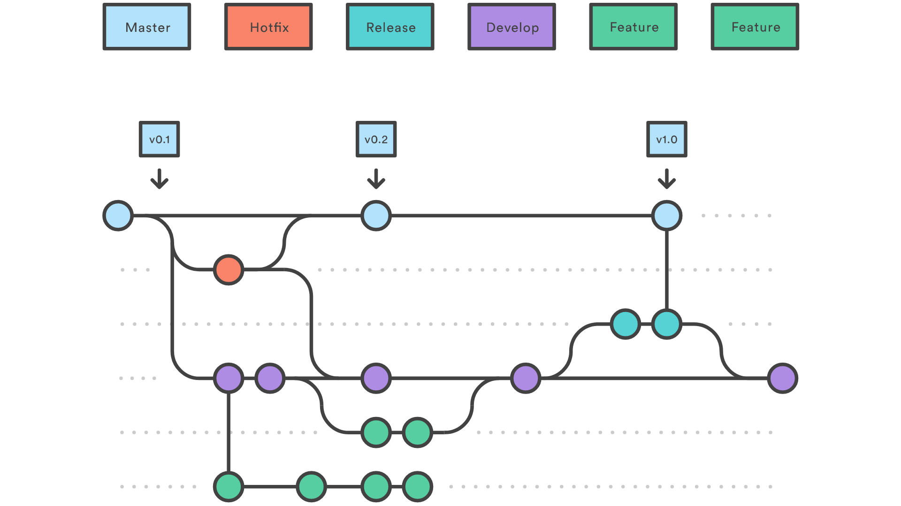

# Documentation as code
- why
- how
- future

---
# Goal

Examples: [dfs180](example/dfs180.html) & [showcase](example/showcase.html)

---
# Word/Sharepoint
- problems with parallel work
- SW &hArr; documentation
- manual process
  - distribution
  - communication with customer

Note: no mass changes possible, e.g. DB board change
----
# Sharepoint issues
- availability
- UX

---
# New way
markdown + github

Atom + plugins

hypothes.is

----
# New way - details

---
# [Markdown](https://rmarkdown.rstudio.com/authoring_pandoc_markdown.html)
- text &rarr; html
- lightweight markup language
  - html tags possible
- edit in atom
----
# .md example

----
# plugins
- [mermaidjs](https://mermaidjs.github.io/)
- [plantuml](http://plantuml.com/)
- [KaTeX](https://khan.github.io/KaTeX/)

----
# plugin - mermaid

----
# plugin - KaTeX

---
# Atom

----
# Atom plugins
- markdown-preview-enhanced
- tool-bar-markdown-writer

---
# Git
- doc next to code
  - automation
- review via [pull requests](https://help.github.com/articles/about-pull-requests/)
- changes tracking (atomic)

Note: every release has its documentation version

----
# Git diff

----
# Git features
- feature branches
- offline work

----
# Learning git
- online: https://www.atlassian.com/git/tutorials
- book: https://git-scm.com/book/en/v2
- youtube
  - https://www.youtube.com/channel/UCP7RrmoueENv9TZts3HXXtw
- courses
  - https://www.lynda.com/search?q=git
  - https://www.coursera.org/learn/version-control-with-git
  - https://www.udemy.com/courses/search/?ref=home&src=ukw&q=git

---
# Git flow

----
# Git pull request

---
# Customer
- html
- [hypothes.is](https://web.hypothes.is/#features)
  - [example](https://web.hypothes.is/faq/)

---
# Near future
- process chain
- css style improvement
- chain (jenkins, aws s3)

---
# Distant future
- plugins (mermaid, ...)
- pdf
- hypothes.is

---
# Q&A
