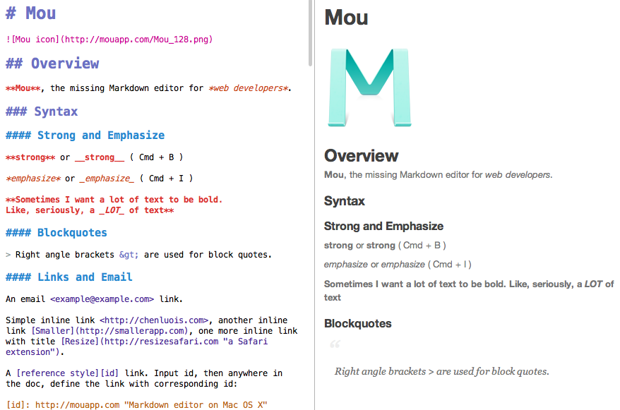
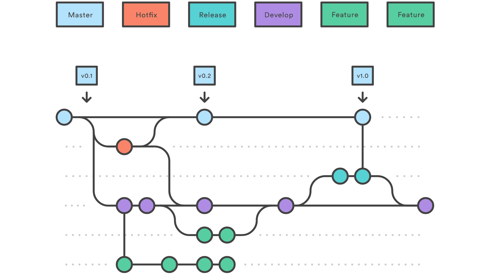
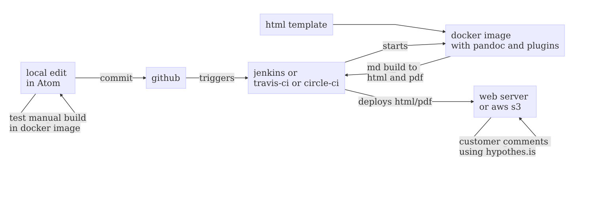

# Documentation as code
- markdown
- git
- git flow
- pandoc

----
# Server
- docker
- jenkins
- AWS S3/

---
# Markdown
- text &rarr; html
- lightweight markup language
- flavors

----
# .md example

----
# Plugins
- Mermaid: https://mermaidjs.github.io/
- PlantUML: http://plantuml.com/
- KaTeX: https://pandoc.org/demo/mathKaTeX.html

---
# Git
- tracks changes
  - atomic
- text

----
# Git detail
- feature branches
- team
- distributed VCS

---
# Git flow

----
# Git pull request

----
# Learning git
- online: https://www.atlassian.com/git/tutorials
- book: https://git-scm.com/book/en/v2
- youtube
  - https://www.youtube.com/channel/UCP7RrmoueENv9TZts3HXXtw
- courses
  - https://www.lynda.com/search?q=git
  - https://www.coursera.org/learn/version-control-with-git
  - https://www.udemy.com/courses/search/?ref=home&src=ukw&q=git

----  
Git tools
- cli
- GUI - GitKraken
- GUI Plugins
  - Visual Studio code
  - Atom
  - Intellij Idea

---
  # hypothes.is
  - Allow external comments
  - example: https://web.hypothes.is/faq/
  - for html and pdf
  - just include
  &lt;script&nbsp;src="https&colon;//hypothes.is/embed.js"&nbsp;async>&lt;/script>

---
# Schema

---
# Comparison
- MS Word
- MediaWiki
- Conluence
- github + md

----

|                  | MS Word | Media Wiki | Conflu ence | github +md                  |
|------------------|---------|-----------|------------|----------------------------|
| wysiwyg          | &starf;&starf;&starf;&starf;&starf;   | &starf;&starf;        | &starf;&starf;&starf;        | &starf;&starf;                         |
| versioning       | &starf;&starf;&starf;     | &starf;         | &starf;          | &starf;&starf;&starf;&starf;&starf;                      |
| collaboration    | &starf;       | &starf;&starf;&starf;       | &starf;&starf;&starf;&starf;&starf;      | &starf;&starf;&starf;&starf;&starf;                      |
| history          | &starf;       | &starf;&starf;        | &starf;&starf;         | &starf;&starf;&starf;&starf;&starf;                      |
| review           | &starf;       | &starf;         | &starf;          | &starf;&starf;&starf;&starf;&starf;                      |

----
|                  | MS Word | Media Wiki | Conflu ence | github +md                  |
|------------------|---------|-----------|------------|----------------------------|
| release          | &starf;&starf;      | &starf;         | &starf;&starf;         | &starf;&starf;&starf;&starf;&starf;                      |
| distribution     | &starf;&starf;      | &starf;&starf;        | &starf;&starf;         | &starf;&starf;&starf;&starf;&starf;                      |
| automation       | &starf;       | &starf;&starf;        | &starf;&starf;         | &starf;&starf;&starf;&starf;&starf;                      |
| backup           | &starf;       | &starf;&starf;        | &starf;&starf;         | &starf;&starf;&starf;&starf;&starf;                      |
| maintenance      | &starf;&starf;&starf;&starf;&starf;   | &starf;         | &starf;          | &starf;&starf;&starf;&starf;                       |

----
|                  | MS Word | Media Wiki | Conflu ence | github +md                  |
|------------------|---------|-----------|------------|----------------------------|
| offline work     | &starf;&starf;&starf;&starf;&starf;   | &starf;         | &starf;          | &starf;&starf;&starf;&starf;&starf;                      |
| price            | &starf;&starf;&starf;&starf;    | &starf;         | &starf;          | &starf;&starf;&starf;&starf;&starf;                      |
| typography       | &starf;&starf;&starf;&starf;    | &starf;&starf;        | &starf;&starf;&starf;        | &starf;&starf;(html) |
| learning curve | &starf;&starf;&starf;&starf; | &starf;&starf;&starf; | &starf;&starf;&starf;&starf; | &starf; |

---
# End
Marek Hudik
